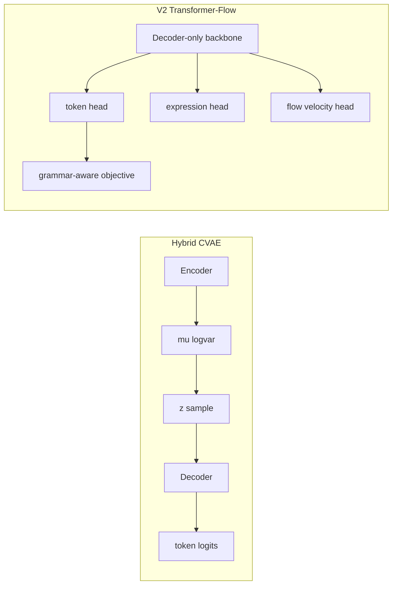
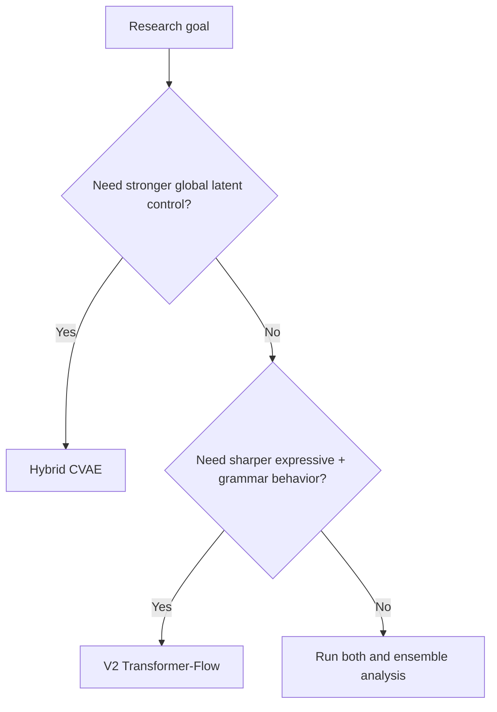

# Direct Comparison: Hybrid CVAE vs V2 Transformer-Flow

## 1. Executive Comparison

| Axis | Hybrid CVAE | V2 Transformer-Flow |
|---|---|---|
| Primary inductive bias | Global latent structure | Multi-term objective coupling |
| Core objective | CE + KL (with annealing/free bits) | CE + Flow MSE + Expr MSE + Grammar |
| Expression modeling | Optional auxiliary branch | Native dual-head flow-aware branch |
| Rhythmic encoding | Conditioning-centric | Explicit taal position encoder |
| Control signals | mood/raga/taal/tempo/duration | mood/raga/taal/tempo/duration |
| Best expected strength | Macro-form coherence | Local expressive sharpness + grammar shaping |

## 2. Architecture Contrast

## 3. Objective Contrast

### Hybrid CVAE

$$
\mathcal{L}_{CVAE} = \mathcal{L}_{recon} + \lambda_{KL}(e)\mathcal{L}_{KL}^{fb}
$$

### Transformer-Flow

$$
\mathcal{L}_{TF} = \mathcal{L}_{token} + \lambda_{flow}\mathcal{L}_{flow} + \lambda_{expr}\mathcal{L}_{expr} + \lambda_{grammar}\mathcal{L}_{grammar}
$$

## 4. Practical Trade-offs

1. Training stability
- Hybrid CVAE: sensitive to KL schedule and collapse prevention.
- V2 TF: sensitive to balancing multi-loss weights.

2. Inference control
- Hybrid CVAE: latent sampling diversity can increase macro variability.
- V2 TF: explicit objective terms can produce tighter tonal/rhythmic behavior.

3. Interpretability
- Hybrid CVAE: latent structure is interpretable at global style level.
- V2 TF: loss-level interpretability via grammar and flow heads.

## 5. Recommendation by Use Case

- If priority is latent style exploration and global form control: start with Hybrid CVAE.
- If priority is expressive dynamics and grammar-aware constrained output: use V2 Transformer-Flow.
- For production research, maintain both and report complementary outcomes.

## 6. Head-to-Head Evaluation Template

| Metric | Hybrid CVAE | V2 TF | Winner |
|---|---:|---:|---|
| Perplexity |  |  |  |
| Raga compliance |  |  |  |
| Taal coherence |  |  |  |
| Expression MSE |  |  |  |
| Expert musicality |  |  |  |

## 7. Comparative Diagram: Decision Path

