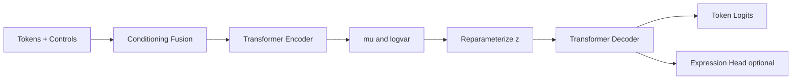
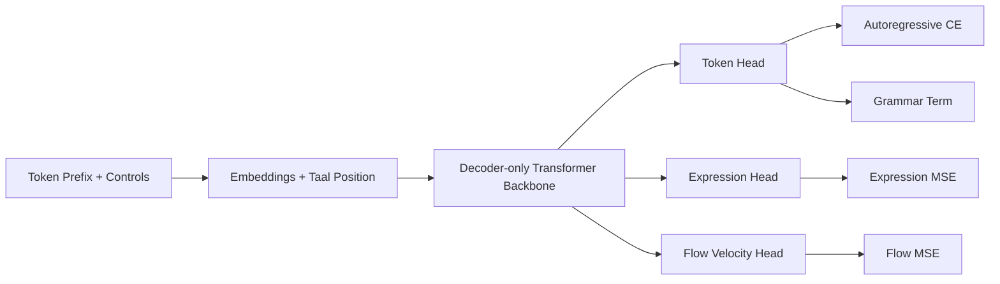
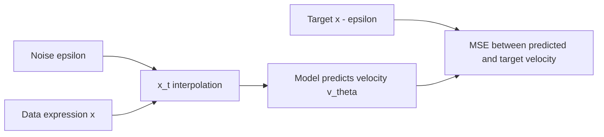
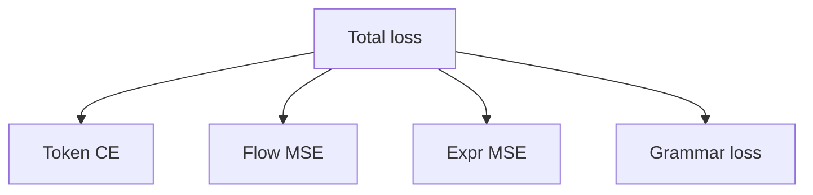
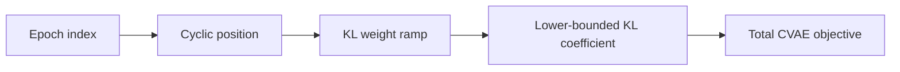
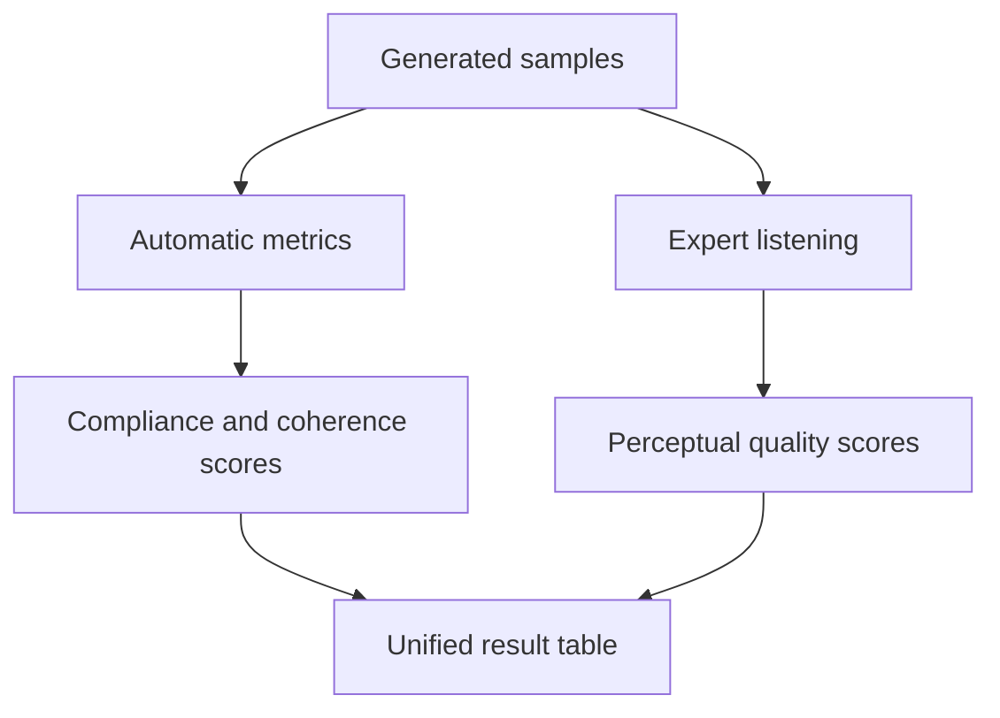
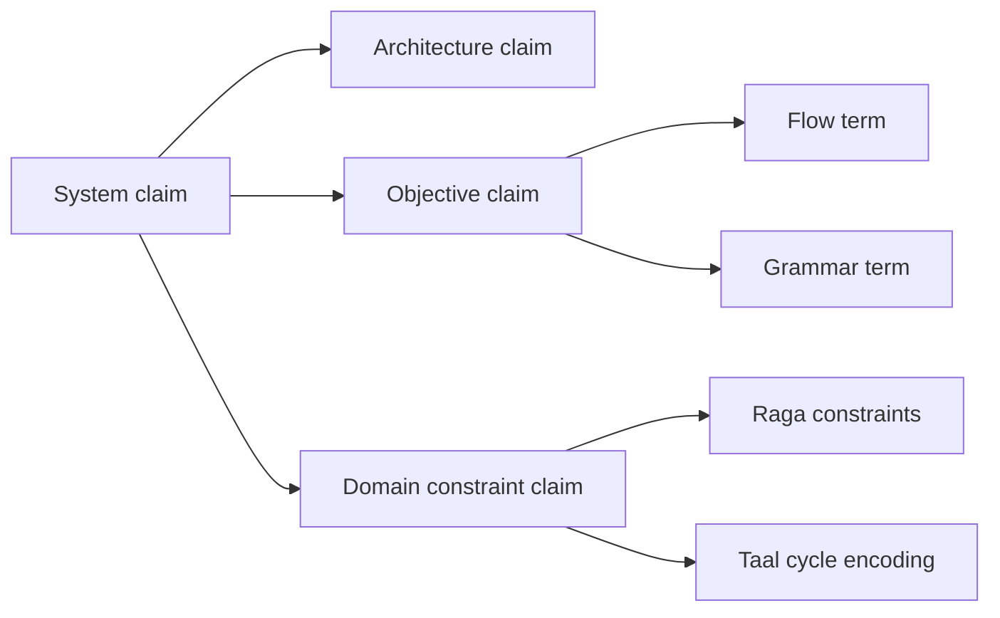

# Research Figures Pack (Mermaid)

This file centralizes reusable Mermaid diagrams for your paper and slides.

## Figure 1: Hybrid CVAE Full Pipeline

## Figure 2: Transformer-Flow Full Pipeline

## Figure 3: Flow-Matching Geometry

## Figure 4: Loss Composition (V2)

## Figure 5: KL Annealing Concept (Hybrid CVAE)

## Figure 6: Evaluation Protocol

## Figure 7: Patent Claim Decomposition

