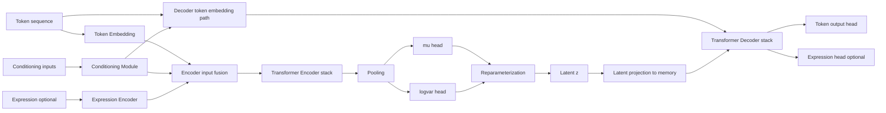
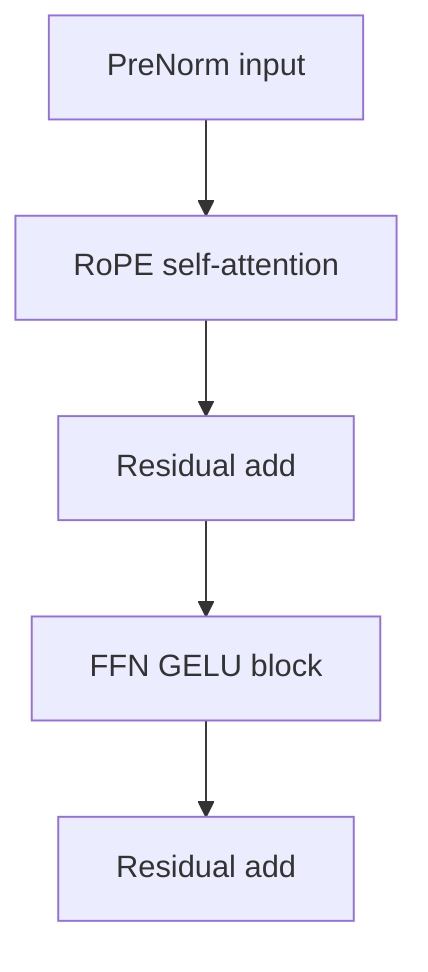
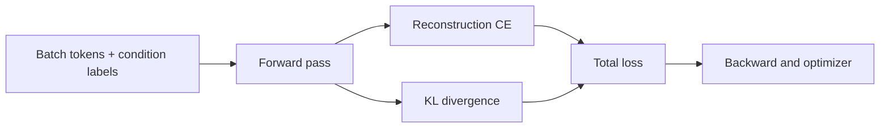
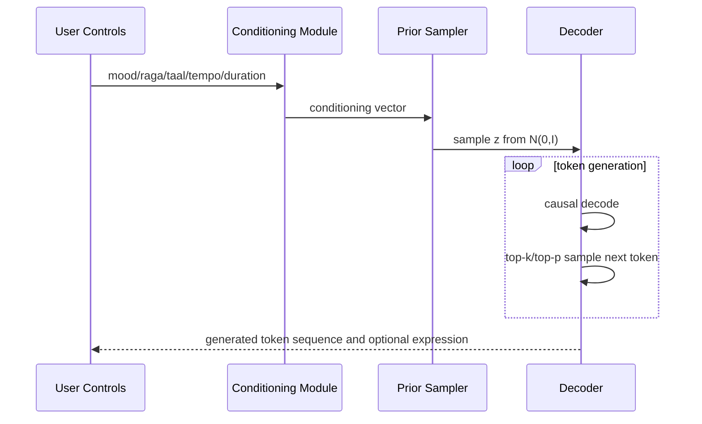

# Hybrid CVAE: Architecture and Pipeline

## 1. Model Intent

The Hybrid CVAE learns controllable Indian classical symbolic music generation by:
- Encoding token sequences into a latent distribution
- Conditioning generation on mood, raga, taal, tempo, and duration
- Decoding autoregressively from sampled latent variables
- Optionally integrating expression features as an auxiliary conditioning and prediction stream

## 2. Full Architecture

## 3. Encoder-Decoder Internals

Decoder extends this with cross-attention to latent memory.

## 4. Conditioning Mechanism

The conditioning module embeds and fuses:
- Mood index
- Raga index
- Taal index
- Tempo scalar
- Duration scalar

The fused vector is projected to model embedding dimension and added to token representations.

## 5. Latent Variable Pathway

- Encoder output is mean-pooled (mask-aware if padding exists).
- Two linear heads produce $\mu$ and $\log\sigma^2$.
- Latent sample uses reparameterization trick.
- Decoder consumes latent memory via cross-attention during autoregressive reconstruction/generation.

## 6. Training Flow

## 7. Generation Flow

## 8. Why This Hybrid Design Is Useful

- Latent space captures global compositional intent.
- Autoregressive decoder preserves sequential structure.
- Conditioning provides direct control for user-facing generation.
- Expression branch allows bridging symbolic and performance-level characteristics.
