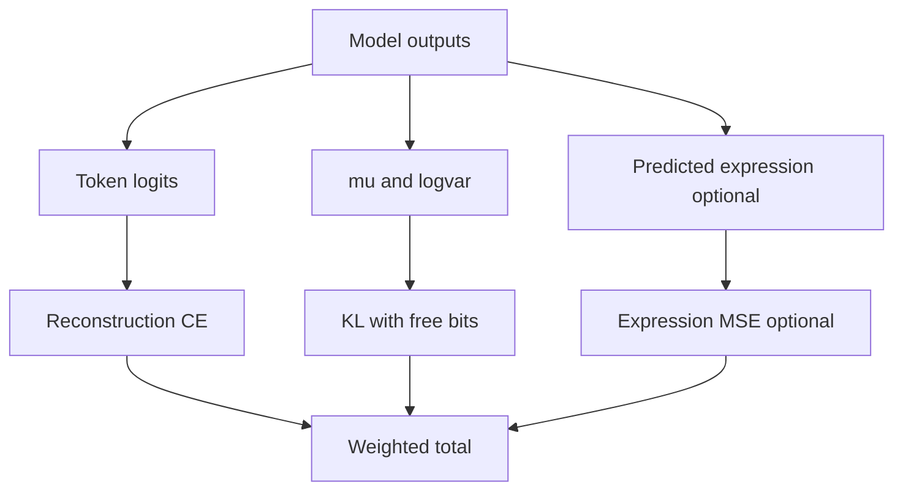

# Hybrid CVAE: Objective Functions and Formulas

## 1. Core CVAE Objective

The training objective is:

$$
\mathcal{L}_{total} = \mathcal{L}_{recon} + \lambda_{KL}(e)\mathcal{L}_{KL}
$$

Where $\lambda_{KL}(e)$ can vary by epoch due to cyclical annealing.

## 2. Reconstruction Loss

Token reconstruction is computed using cross-entropy with label smoothing:

$$
\mathcal{L}_{recon} = \text{CE}(\text{logits}, x)
$$

Implementation details include:
- Ignore padding index
- Mean reduction
- Label smoothing of 0.1

## 3. KL Divergence Loss

For posterior $q_\phi(z|x,c)=\mathcal{N}(\mu, \sigma^2)$ and prior $p(z)=\mathcal{N}(0, I)$:

$$
\mathcal{L}_{KL} = -\frac{1}{2}\left(1 + \log\sigma^2 - \mu^2 - \sigma^2\right)
$$

Implemented per-dimension and then averaged.

## 4. Free-Bits Stabilization

Free-bits floor is applied before averaging:

$$
\mathcal{L}_{KL}^{fb} = \text{mean}(\max(\mathcal{L}_{KL}, \tau))
$$

with threshold $\tau=0.5$ in the training script.

## 5. Cyclical KL Annealing

KL weight is annealed cyclically per epoch:

$$
\lambda_{KL}(e)=\max\left(\lambda_{min},\,\lambda_0\cdot\min\left(1,\frac{\text{cycle\_pos}}{0.5\cdot\text{cycle\_len}}\right)\right)
$$

This reduces posterior collapse risk and supports better latent usage.

## 6. Reparameterization Equation

Latent sampling uses:

$$
z = \mu + \sigma \odot \epsilon, \quad \epsilon \sim \mathcal{N}(0, I), \quad \sigma=\exp(0.5\log\sigma^2)
$$

## 7. Expression Path (Hybrid Mode)

When expression is enabled:
- Expression encoder produces frame-level representations.
- Global expression embedding can be fused into conditioning.
- Decoder hidden states can produce predicted expression via expression head.

If you include expression supervision externally, an additional term can be stated:

$$
\mathcal{L}_{expr}=\|\hat{e}-e\|_2^2
$$

and total becomes:

$$
\mathcal{L}_{total}=\mathcal{L}_{recon}+\lambda_{KL}\mathcal{L}_{KL}^{fb}+\lambda_{expr}\mathcal{L}_{expr}
$$

## 8. Diagram: Loss Composition

## 9. Practical Optimization Notes

- Mixed precision and gradient accumulation are used for large models.
- Gradient clipping is applied to stabilize updates.
- Warmup + cosine schedule are used in the training code.
