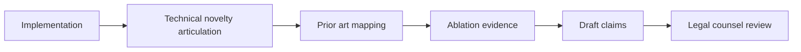

# Hybrid CVAE: Novelty, Uniqueness, and Patentability Analysis

## 1. Candidate Novel Aspects

Potentially novel aspects in this implementation include:

1. Domain-conditioned CVAE for Indian classical generation with explicit raga/taal conditioning.
2. RoPE-enabled pre-norm Transformer encoder-decoder integrated with latent-variable modeling.
3. Optional expression-conditioning path that couples symbolic generation with performance descriptors.
4. Practical large-scale training strategy (free bits, cyclical KL, gradient checkpointing) for long symbolic sequences.

## 2. How the Hybrid Structure Works

This model is hybrid in representation and conditioning:
- Symbolic stream: tokenized MIDI sequence modeling.
- Continuous stream: expression features as optional encoder input and decoder-level prediction target.
- Shared latent variable: global stochastic representation tying structure and control variables.

## 3. What Makes It Distinct Relative to Standard CVAEs

Compared to a standard text-conditioned CVAE, this system adds:
- Music-theory-grounded conditioning axes (raga, taal).
- Time-structure control through explicit rhythmic label conditioning.
- Optional expression branch for richer performance-level behavior.
- Architecture choices that support large sequence lengths and scalable training.

## 4. Prior Art Positioning

Conservative framing for your paper:
- Conditional VAEs are established in sequence generation.
- Transformer-based symbolic music models are established.
- Audio-expression conditioning is explored in related domains.
- The specific integration for Indian classical controllable generation appears underexplored and can be presented as a targeted methodological contribution.

## 5. Patentability Considerations (Non-Legal Guidance)

### 5.1 Is patent filing plausible?

Potentially yes, if novelty and non-obviousness can be demonstrated over combined prior art.

### 5.2 Claim strategy direction

Prefer claiming:
- A specific control-and-latent architecture for raga/taal-conditioned generation.
- A training procedure with explicit free-bits and cyclical KL schedule under this domain setting.
- A symbolic-expression hybrid conditioning pathway tied to latent reconstruction.

Avoid relying on claims that are too broad (generic CVAE/Transformer statements).

### 5.3 Evidence you should collect

1. Baseline comparisons against non-hybrid CVAE and non-latent autoregressive variants.
2. Ablations on expression branch and domain controls.
3. Raga-identification and rhythmic-consistency metrics.
4. Expert listening evaluations.
5. Reproducible implementation details and algorithm pseudo-code.

## 6. Diagram: Claim Readiness Pipeline

## 7. Suggested Responsible Wording

"The proposed Hybrid CVAE contributes a domain-specialized controllable generation framework by combining latent-variable sequence modeling, Indian classical conditioning controls, and optional expression-informed representations in a single trainable architecture."

This wording is assertive but avoids unsupported legal certainty.
