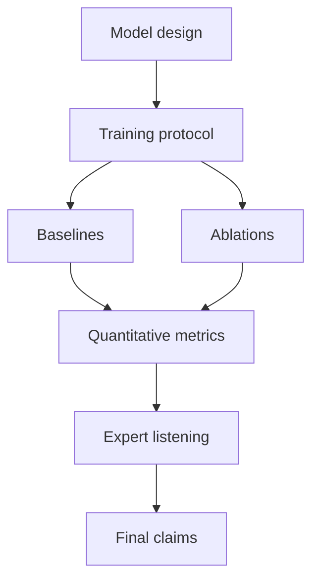

# Hybrid CVAE: Research Paper Ready Sections

## 1. Method Section Draft

We present a Hybrid Conditional Variational Autoencoder for controllable Indian classical symbolic music generation. The model receives a tokenized MIDI sequence and control metadata (mood, raga, taal, tempo, duration). An encoder Transformer maps the conditioned sequence to latent posterior parameters, from which a latent sample is drawn via reparameterization. A decoder Transformer reconstructs and generates token sequences autoregressively while attending to latent memory. The architecture optionally incorporates expression features to improve performative realism.

## 2. Suggested Contributions List

1. A domain-conditioned CVAE architecture for Indian classical controllable generation.
2. A large-scale training recipe combining free-bits KL and cyclical KL annealing.
3. Optional expression-aware pathway for symbolic-performance coupling.
4. Empirical analysis on raga-aware controllability and sequence quality.

## 3. Recommended Figures

1. Full architecture block diagram (encoder, latent, decoder, controls).
2. KL annealing schedule visualization.
3. Latent traversal examples showing control sensitivity.
4. Ablation figure with/without expression and KL schedule variants.

## 4. Ablation Matrix Template

| Variant | Expression branch | Free bits | Cyclical KL | Raga controls | Sequence quality | Control fidelity |
|---|---|---|---|---|---:|---:|
| Full model | on | on | on | on |  |  |
| No expression | off | on | on | on |  |  |
| No free bits | on | off | on | on |  |  |
| No cyclical KL | on | on | off | on |  |  |
| Reduced controls | on | on | on | partial |  |  |

## 5. Evaluation Suggestions

1. Perplexity / token-level negative log-likelihood.
2. Control adherence score for raga and taal labels.
3. Diversity metrics across latent samples.
4. Expert ratings for stylistic plausibility.
5. Long-horizon coherence over extended generated sequences.

## 6. Reproducibility and Reporting

Include in appendix:
- Exact config values
- GPU and precision settings
- Batch and gradient-accumulation settings
- Checkpoint and early-stopping criteria
- Decoding parameters for all reported samples

## 7. Limitations and Risks

- CVAE latent collapse risk if KL scheduling is not tuned.
- Symbolic correctness may not guarantee high perceptual quality.
- Style generalization may be uneven across underrepresented ragas.
- Evaluation remains partly subjective due to music perception variability.

## 8. Diagram: Experimental Narrative

