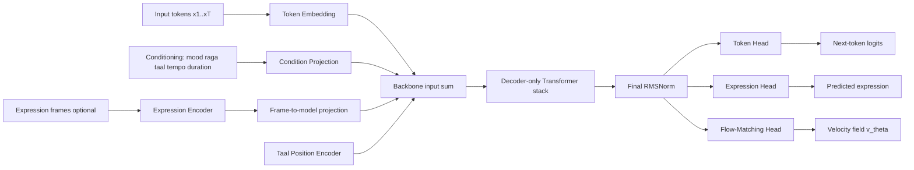
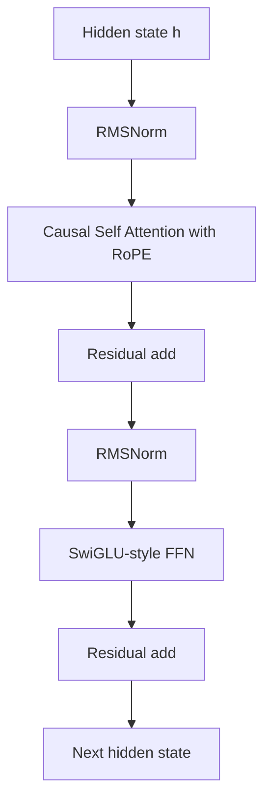
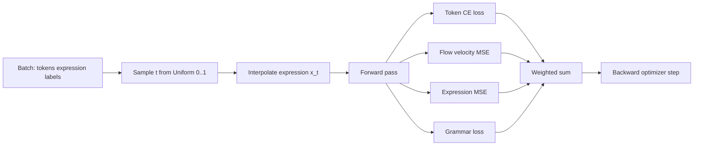
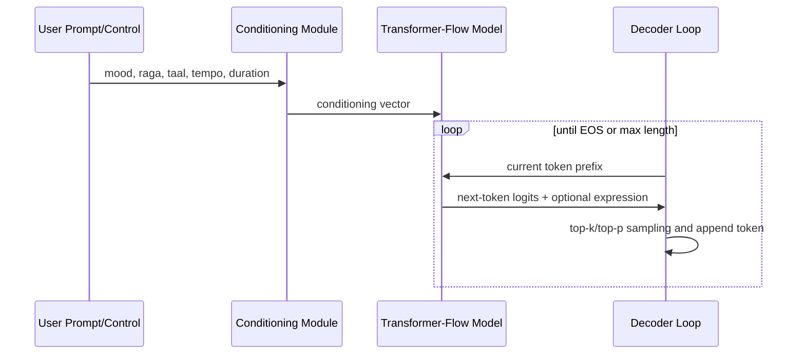

# V2 Transformer-Flow: Architecture and Pipeline

## 1. High-Level Concept

The V2 model combines:
- Discrete autoregressive symbolic modeling (BPE MIDI token stream)
- Continuous flow-matching for musical expression contours
- Domain-aware grammar shaping for raga compliance
- Taal-aware rhythmic positional structure

This creates a dual-output generator that predicts both symbolic note events and performance expression dynamics.

## 2. End-to-End Architecture

## 3. Internal Block Design

## 4. Conditioning Path

The conditioning vector is formed by concatenating:
- Mood embedding
- Raga embedding
- Taal embedding
- Tempo scalar projection
- Duration scalar projection

Then projected to model dimension and broadcast across sequence length.

## 5. Rhythmic (Taal) Structure Injection

Taal position is modeled with:
- Cycle-position embedding: position modulo taal cycle length
- Beat-strength embedding: sam and other beat strengths

This adds an explicit rhythmic inductive bias so token generation can track cyclic rhythmic structure.

## 6. Training Pipeline

## 7. Inference Pipeline

## 8. Why This Architecture Matters

- Symbolic branch preserves grammar and long-form structure.
- Continuous branch captures expressive rendering behavior.
- Shared backbone allows interaction between symbolic and expressive cues.
- Grammar term biases the model toward musically valid raga pitch behavior.
