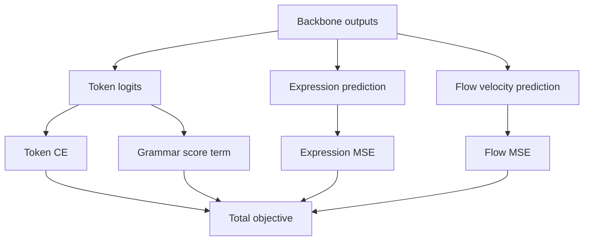

# V2 Transformer-Flow: Objective Functions and Formulas

## 1. Total Training Objective

The implemented training objective is:

$$
\mathcal{L}_{total} = \mathcal{L}_{token} + \lambda_{flow}\mathcal{L}_{flow} + \lambda_{expr}\mathcal{L}_{expr} + \lambda_{grammar}\mathcal{L}_{grammar}
$$

Where in code-level defaults:
- $\lambda_{flow} =$ flow_loss_weight
- $\lambda_{expr} =$ expression_loss_weight
- $\lambda_{grammar} =$ grammar_loss_weight

## 2. Token Objective (Autoregressive CE)

Given sequence $x_{1:T}$, shifted prediction is:
- Inputs: $x_{1:T-1}$
- Targets: $x_{2:T}$

Cross-entropy with padding ignore and label smoothing:

$$
\mathcal{L}_{token} = \text{CE}(\text{logits}_{1:T-1}, x_{2:T})
$$

## 3. Flow-Matching Construction

For expression tensor $x$ and Gaussian noise $\epsilon \sim \mathcal{N}(0, I)$, sample time $t \sim \mathcal{U}(0,1)$:

$$
x_t = (1-t)\epsilon + t x
$$

Target velocity:

$$
v^*(x_t, t) = x - \epsilon
$$

Model predicts $v_\theta(x_t,t)$, and the flow objective is:

$$
\mathcal{L}_{flow} = \|v_\theta(x_t,t) - v^*(x_t,t)\|_2^2
$$

Implemented with masking when expression labels are unavailable for some samples.

## 4. Auxiliary Expression Regression

The model also predicts expression directly from hidden states:

$$
\hat{x} = g_\theta(h)
$$

With MSE loss:

$$
\mathcal{L}_{expr} = \|\hat{x} - x\|_2^2
$$

This stabilizes early training and improves expressive continuity.

## 5. Grammar-Aware Raga Loss

The grammar term modifies token distributions using:
- Vivadi (discouraged) pitch-class probability penalty
- Vadi and samvadi (important tones) probability rewards

Generic form:

$$
\mathcal{L}_{grammar} = \alpha \cdot \mathbb{E}[p_{vivadi}] - \beta \cdot \mathbb{E}[p_{vadi}] - \gamma \cdot \mathbb{E}[p_{samvadi}]
$$

Where:
- $\alpha$ corresponds to vivadi_penalty_multiplier
- $\beta$ corresponds to vadi_reward_weight
- $\gamma$ corresponds to samvadi_reward_weight

## 6. Transformer Core Computation

For each block:

$$
h' = h + \text{Attn}(\text{RMSNorm}(h))
$$
$$
h'' = h' + \text{FFN}(\text{RMSNorm}(h'))
$$

Feed-forward uses gated activation (SwiGLU style):

$$
\text{FFN}(h) = W_2(\text{SiLU}(W_1 h) \odot W_3 h)
$$

## 7. RoPE Attention Form

Queries and keys are rotationally transformed:

$$
q' = q \odot \cos(\Theta) + \text{rot}(q) \odot \sin(\Theta)
$$
$$
k' = k \odot \cos(\Theta) + \text{rot}(k) \odot \sin(\Theta)
$$

This preserves relative phase information and supports better long-context extrapolation.

## 8. Optimization Notes

- Mixed precision supported
- Gradient accumulation and micro-batching available
- Optional gradient checkpointing for memory scaling
- Cosine schedule with warmup used in training code

## 9. Diagram: Loss Composition

