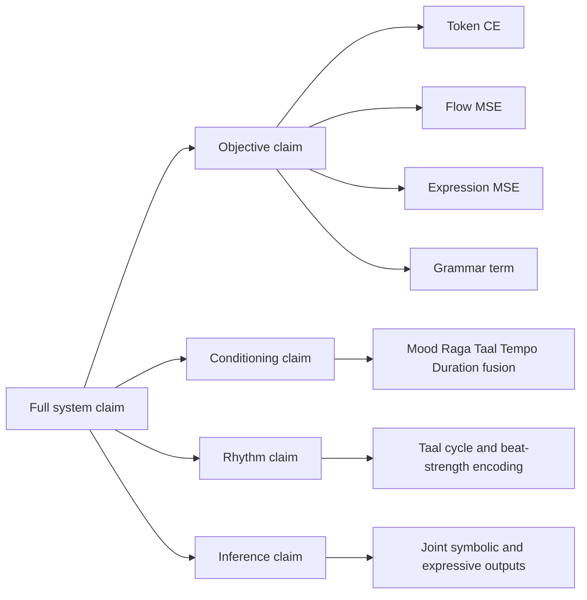

# V2 Transformer-Flow: Novelty, Uniqueness, and Patentability Analysis

## 1. Candidate Novel Contributions

Based on current implementation, potential novelty points are:

1. Joint symbolic-plus-flow training objective for Indian classical generation.
2. Simultaneous autoregressive token modeling and continuous expression vector-field learning.
3. Raga grammar shaping in the training loss through vivadi penalty and vadi/samvadi rewards.
4. Taal-cycle positional encoding integrated into decoder conditioning.
5. Unified conditioning fusion for mood, raga, taal, tempo, and duration with expression-aware path.

Important: these are candidate contributions, not legal determinations of novelty.

## 2. How the Hybrid Structure Works in This Model

The model is hybrid at objective and representation level:
- Discrete channel: BPE tokens generated autoregressively.
- Continuous channel: expression dynamics learned by flow matching and direct regression.
- Shared hidden state lets symbolic and expressive branches influence each other.

## 3. What Makes It Potentially Unique

Potentially unique combination in this codebase:
- Domain-constrained grammar loss + cyclic rhythmic encoding + expression flow objective in one training loop.
- Raga-specific tonal preferences directly optimized as differentiable penalties/rewards.
- Expression as both an input signal and an output target, not only post-processing.

## 4. Prior Art Positioning (Research Framing)

Use this framing in the paper:
- General symbolic music transformers exist.
- CVAE-based music models exist.
- Diffusion and flow methods for audio/music exist.
- Domain-specific Indian classical grammar-constrained flow-based symbolic generation appears less explored.

Your contribution can be written as a compositional novelty:
- Not necessarily inventing each component,
- But integrating them into a coherent, code-implemented method tailored to raga-taal constraints.

## 5. Patentability Discussion (Non-Legal Guidance)

This section is practical strategy guidance, not legal advice.

### 5.1 Can this be patented?

Potentially yes, if you can show:
- Novelty: no single prior publication/patent discloses the same full method.
- Non-obviousness: the integration is not an obvious combination for a skilled practitioner.
- Utility: measurable improvement in musical validity, expression fidelity, or controllability.

### 5.2 What to claim

Stronger claim focus:
- Specific training objective composition with grammar-aware differentiable terms.
- Taal-cycle encoding coupled with grammar-aware token objective.
- Joint flow velocity field learning for expression aligned with symbolic decoding.

Weaker claim focus:
- Generic transformer architecture alone.
- Generic top-k/top-p decoding alone.

### 5.3 Evidence package for filing

Prepare:
1. Ablations showing each unique component improves outcomes.
2. Comparison against baselines without grammar and without flow head.
3. Quantitative grammar-compliance metrics.
4. Human evaluation for raga identity and expressivity.
5. Detailed algorithmic pseudo-code and reproducible configs.

## 6. Diagram: Claim Decomposition

## 7. Suggested Paper Wording for Novelty

Possible conservative wording:

"We propose a domain-informed Transformer-Flow framework that jointly models symbolic note events and continuous expression trajectories for Indian classical music. Our method combines autoregressive token likelihood, flow-matching dynamics, and raga grammar-aware differentiable constraints under a unified training objective with taal-aware positional conditioning."

This wording is strong but does not overclaim legal novelty.
