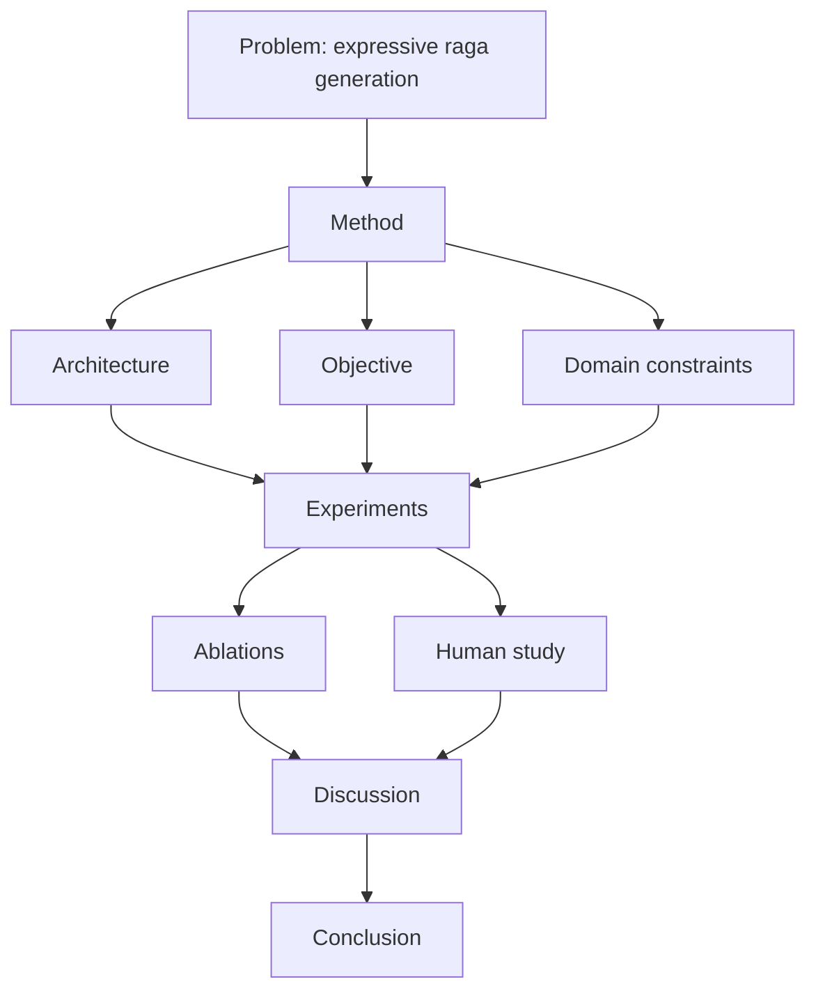

# V2 Transformer-Flow: Research Paper Ready Sections

## 1. Method Section Draft

We introduce a Transformer-Flow architecture for Indian classical symbolic music generation with expression-aware rendering. The model is conditioned on mood, raga, taal, tempo, and duration. A decoder-only Transformer with RoPE and RMSNorm predicts next-token distributions while auxiliary heads learn expression trajectories and flow-matching vector fields. Taal-cycle positional embeddings encode rhythmic periodicity. Training minimizes a weighted objective combining autoregressive token likelihood, flow-matching velocity error, direct expression regression, and a grammar-aware tonal term based on raga-specific vivadi/vadi/samvadi behavior.

## 2. Figure Checklist

Include these figures:
1. Full model architecture (symbolic + expression branches).
2. Training objective decomposition.
3. Flow interpolation geometry for expression dynamics.
4. Ablation summary chart for each objective term.

## 3. Suggested Ablation Table Layout

| Variant | Token Loss | Flow Loss | Expr Loss | Grammar Loss | Raga Compliance | Expression Fidelity | Human Score |
|---|---:|---:|---:|---:|---:|---:|---:|
| Full model | on | on | on | on |  |  |  |
| No flow | on | off | on | on |  |  |  |
| No grammar | on | on | on | off |  |  |  |
| No expr aux | on | on | off | on |  |  |  |
| No taal-pos | on | on | on | on |  |  |  |

## 4. Evaluation Protocol Suggestions

1. Tonal compliance score
- Fraction of generated note-on tokens belonging to raga-permitted pitch classes.

2. Vadi/samvadi emphasis score
- Relative probability mass on vadi and samvadi tones.

3. Rhythmic cycle coherence
- Beat-aligned repetition and cycle-boundary consistency.

4. Expression consistency
- MSE and correlation between predicted and reference expression profiles.

5. Human evaluation
- Expert ratings for raga identity, musicality, and expressivity.

## 5. Reproducibility Checklist

- Fixed random seeds
- Full config JSON in supplementary
- Training command and hardware details
- Dataset and preprocessing protocol
- Checkpoint selection criterion
- Inference decoding hyperparameters

## 6. Threats to Validity

- Dataset bias toward specific ragas or recording styles
- Tokenization artifacts from BPE merge statistics
- Subjectivity of musical quality judgments
- Potential mismatch between symbolic correctness and perceptual quality

## 7. Diagram: Paper Flow

